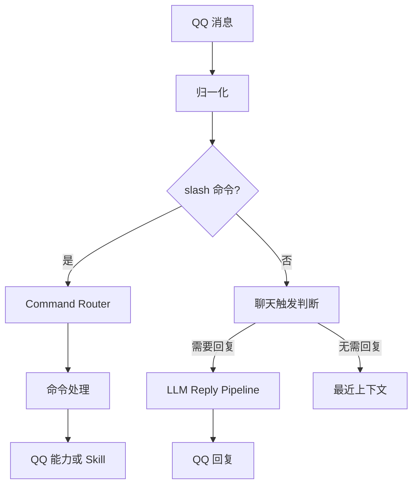

# 小尘 QQ Bot

这是一个基于 QQ 官方 Bot API 的个人 QQ Bot，使用 TypeScript 和 Node.js。它首先提供 QQ 命令、交互和本地能力；LLM 聊天是其中一项能力。

## 当前功能

- `/xxx` 命令由本地路由执行，未知命令由本地回复。
- Minecraft 服务器状态查询、状态卡和刷新按钮共用同一查询能力。
- 群聊和私聊中的 AI 回复支持最近 20 条群聊上下文、已见群成员、按需识图与网页搜索。
- 普通 AI Attempt 最长 30 秒；无新消息时普通超时会在同一 Reply Cycle 内重试一次，因此最多约 60 秒。实际触发 Web Search 后仍以 Cycle 开始后 120 秒为上限，超时不重试。
- 每个 conversation 同时只运行一个 AI Attempt；生成中最多被新消息打断 3 次，每次都基于最新上下文重试，剩余消息进入下一 Cycle。
- 结构化 `qq_reply` 支持 Markdown 和已知成员 @；生成完成后进入 QQ 发送阶段，新消息不会中止已完成的回复。
- 自然聊天时，AI 可通过结构化 `qq_reply` 一次发送最多三条连续 QQ 消息；Node 不按标点自动拆分。
- AI 可按需调用只读 `meme_lookup`，查询项目内维护的网络梗摘要。
- 群聊可按 @、名字或活跃会话触发；模型可以选择 `<NO_REPLY>`。

## 命令

| 命令 | 说明 |
| --- | --- |
| `/help` | 查看可用命令 |
| `/mc` | 查看 Minecraft 服务器状态 |
| `/members` | 查看目前认识的群成员 |
| `/at 昵称` | 测试 @ 已知群成员 |

`/help` 的内容由命令注册表生成。`@小尘 /mc` 会按 `/mc` 处理。未注册的 slash 命令会收到本地提示，不进入 AI 聊天。

## 消息处理



命令消息默认不写入自然聊天的最近上下文。`/mc` 命令和刷新按钮都调用 Minecraft 状态能力，命令文件不复制查询逻辑。

## AI 聊天

### Conversation Reply Cycle

每个 conversation 同时最多一个生成中的 AI Attempt。生成中的新消息会 abort 当前 Attempt 并重建最新上下文，每个 Cycle 最多三次中断；达到上限后新消息缓存到下一 Cycle。普通 Attempt 30 秒内无新信息而超时，会在同一 Cycle 中重建 snapshot 并重试一次；第二次普通超时沿用 soft 静默或 hard fallback。Responses 流实际发出 Web Search 事件时，继续使用 Cycle 开始后 120 秒的绝对上限，超时不重试。

QQ Reply Skill 每次可发送 1～3 条消息，每条独立选择 `auto`、`none` 或当前 Attempt 的临时 `[mN]` 引用目标；Node 在发送时映射到真实 QQ message reference，真实消息 ID 只由 Node 管理，不进入模型输入。`mentions` 仍只在第一条实际消息发送。用户主动引用的 QQ 消息会尽量通过 SDK 的引用索引或事件中的引用内容显示给 AI；内容不可用时安全降级，不影响当前消息。

Meme Runtime 在启动时从名称和别名派生中文拼音、首字母检索键，支持中文、全拼、缩写、大小写及部分混合输入。检索区分强命中和弱候选；强命中优先给 AI `interactions` 常见接法，弱候选提示谨慎判断。派生键只留在内存，不写入 Meme 数据或提供给模型。

群聊中，真正 @ 小尘是强触发；提到“小尘”或处于活跃会话时是软触发。普通非活跃群消息只记录上下文。软触发时模型可以输出 `<NO_REPLY>`。图片仅在满足识图触发条件时发送给模型；网页搜索由模型按需选择。

联网搜索结果会将 Responses API 提供的引用转换为普通 Markdown 来源链接；来源元数据缺失时会隐藏内部引用标记。

### QQ Reply Skill

`qq_reply` 只让模型表达最终 QQ 回复意图：1～3 条文字、已知群友昵称和引用偏好。普通 `output_text` 也会归一化成同一个 `QQReplyAction`，随后由 Reply Coordinator 判断请求是否仍有效、是否必须引用触发消息。QQ Renderer 将昵称解析为真实 @ 并生成 Markdown；QQ Sender 才调用腾讯 SDK。模型不能指定消息 ID、用户 OpenID、API payload 或文件路径。

未来若加入图片或表情包，可由独立 Asset Skill 返回可信 asset ID，Node 在 Renderer / Sender 边界解析本地资源并通过 SDK `sendImage` 发送；当前尚无用户可见的表情包回复功能。

### Meme Skill

`src/skills/meme/data/memes.json` 是可提交 Git 的静态网络梗知识文件。每条保存 `id`、名称与别名、摘要、背景、含义、用法、示例，以及可选的 `interactions` 常见接法。Runtime 启动时校验文件并建立只读内存索引；自动匹配最多投影 3 条精简候选，明确询问含义或背景时才提供详细内容。`meme_lookup` 是模型不确定时的只读查询。来源核实由现有 `web_search` 临时完成，不写入知识文件；Bot 运行时也不会写回知识文件。

维护入口独立于 Bot：

```bash
pnpm meme:update --dry-run
pnpm meme:update "汗流浃背了吧老弟"
pnpm meme:update
pnpm meme:update --limit 10
```

脚本使用 `CODEX_API_KEY` 和 `CODEX_BASE_URL` 调用 Responses API、`web_search` 和严格结构化输出，查找梗的出处、含义及使用语境；Node 校验后合并写入 JSON。`--dry-run` 完成研究与校验，但不写文件。执行写入后，请人工查看 `git diff` 和来源，再决定是否提交。脚本不会执行 Git 操作。Bot 的本地命令不需要 AI 环境变量。

TenBot 内置 GPT 和 DeepSeek 两个 Model Plugin，通过 `AI_PROVIDER` 选择，未设置时使用 GPT。它们是 TenBot 内部的模型适配层，不是第三方插件生态。两者分别加载自己的 Prompt；GPT 提供内建网页搜索，DeepSeek 当前不提供网页搜索，但仍可正常聊天并调用 `qq_reply` 和 `meme_lookup`。

GPT 使用现有 Responses API 兼容地址配置；DeepSeek 使用独立的官方 Responses API 配置。只有实际发起聊天请求时才读取所选模型的密钥。本地 QQ 命令不依赖模型服务。

## 项目结构

```text
src/
  main.ts                 启动
  commands/               命令注册表与路由
  qq/
    bot.ts                QQ Bot 创建及事件注册
    handlers/             消息与按钮入口
    message/              入站归一化和触发判断
    conversation/         最近上下文、活跃会话、成员业务规则
    reply/                AI 回复协调、渲染与 QQ 发送
    minecraft-status*.ts  Minecraft 状态回复
  skills/                 Minecraft、只读 Meme 与 QQ Reply 表达能力
  ai/                     Runtime 输入/结果、模型注册和内建 Model Plugins
    plugins/gpt/           GPT 适配和专属 Prompt
    plugins/deepseek/      DeepSeek 适配和专属 Prompt
  shared/                 日志
  members/                MemberRepository、SQLite 与 D1 适配器
migrations/               D1 成员表迁移 SQL
scripts/meme-update.ts     手动运行的网络梗研究与更新脚本
```

Command 是用户明确调用的 QQ 入口；Skill 是命令、按钮或 AI Tool 可共用的内部能力；LLM 处理普通自然语言聊天。

## 环境变量

| 变量 | 用途 |
| --- | --- |
| `QQBOT_APP_ID` | QQ Bot 应用 ID |
| `QQBOT_APP_SECRET` | QQ Bot 应用密钥 |
| `AI_PROVIDER` | 模型选择：`gpt` 或 `deepseek`；默认 `gpt` |
| `CODEX_API_KEY` | GPT 后端密钥；GPT 聊天与 `meme:update` 需要 |
| `CODEX_BASE_URL` | GPT Responses API 兼容地址；GPT 聊天与 `meme:update` 需要 |
| `CODEX_MODEL` | 可选 GPT 模型名；默认 `gpt-6-sol` |
| `DEEPSEEK_API_KEY` | DeepSeek API 密钥 |
| `DEEPSEEK_BASE_URL` | 可选 DeepSeek API 地址；默认 `https://api.deepseek.com` |
| `DEEPSEEK_MODEL` | 可选 DeepSeek 模型名；默认 `deepseek-flash` |
| `BOT_LOG_LEVEL` | 日志级别，支持 `info`、`debug`、`error` |
| `AUTOMATED_PEER_IDS` | 逗号分隔的已登记自动化 QQ 群成员稳定 ID（`member_openid`） |
| `BOT_LOOP_GUARD_MAX_CYCLES` | 每个会话允许连续触发的自动账号 AI Cycle 数；默认 `4`，最小 `1` |

将密钥放在本地 `.env`，不要提交真实值。`BOT_LOG_LEVEL=info` 适合日常运行；`BOT_LOG_LEVEL=debug` 会输出更多诊断信息。

只按稳定群成员 ID（`member_openid`）匹配，不按昵称或推测的 Bot 行为识别。设置 `AUTOMATED_PEER_IDS=id1,id2` 后重启 TenBot。需要查询 ID 时，临时设置 `BOT_LOG_LEVEL=debug`，从 `[Peer]` 身份日志复制完整 ID，然后恢复为 `info`。达到每会话 Cycle 上限后会停止 AI 调用，直到收到未登记的真人消息。计数只保存在内存中，TenBot 重启后清零。

## 安装与开发

需要 Node.js 和 pnpm。

```bash
pnpm install
pnpm dev
```

静态检查与离线测试：

```bash
pnpm exec tsc --noEmit
pnpm test
```

当前没有单独的 build 或 lint script。

## 本地数据与限制

已见群成员通过 `MemberRepository` 读写。当前 Node.js 运行使用内置 SQLite，数据库位于 `data/bot.db`；`/members`、昵称回填、AI 的 `known_group_members` 和 QQ @ 解析都经由成员服务查询。数据库无法打开时，本次运行会退回内存成员存储并记录错误。已见成员列表不等于 QQ 全群成员列表。

`migrations/0001_group_members.sql` 建立 `group_members` 表。未来接入 Cloudflare Worker 时，可对 D1 执行该迁移，并把 D1 binding 注入 `D1MemberRepository`；仓库目前没有 Worker 入口或 D1 binding 配置，也没有部署到 Cloudflare。最近上下文、活跃会话和待处理 AI 请求仍是内存状态。

旧版 `data/known-members.json` 不会自动导入 SQLite。本仓库当前没有该文件；旧数据可以保留作备份，让 Bot 在群消息中重新学习成员。不要把旧 JSON、SQLite 数据库或成员标识提交到 Git。

当前安装的 QQ SDK 1.0.4 没有普通群消息撤回的入站事件，因此真实撤回暂时无法自动取消 AI 请求；内部已支持按触发消息 ID 取消并删除最近上下文。QQ 平台可用的消息类型和交互能力受官方 API 权限限制。AI 聊天依赖外部 Responses API 兼容后端。

## TenBot TUI

Run `pnpm tui` to start TenBot with its local terminal control surface. It shows QQ connection, the selected model, runtime counts, and recent logs. Press `p` to reload the active provider prompt, `m` to reload `memes.json`, `r` to reload both, or `q` / Ctrl+C for graceful shutdown.

The TUI and Runtime run in the same process and communicate through the serializable `TenBotControl` interface. This release adds no HTTP or WebSocket API; a future web control surface can reuse the same Control Layer.
