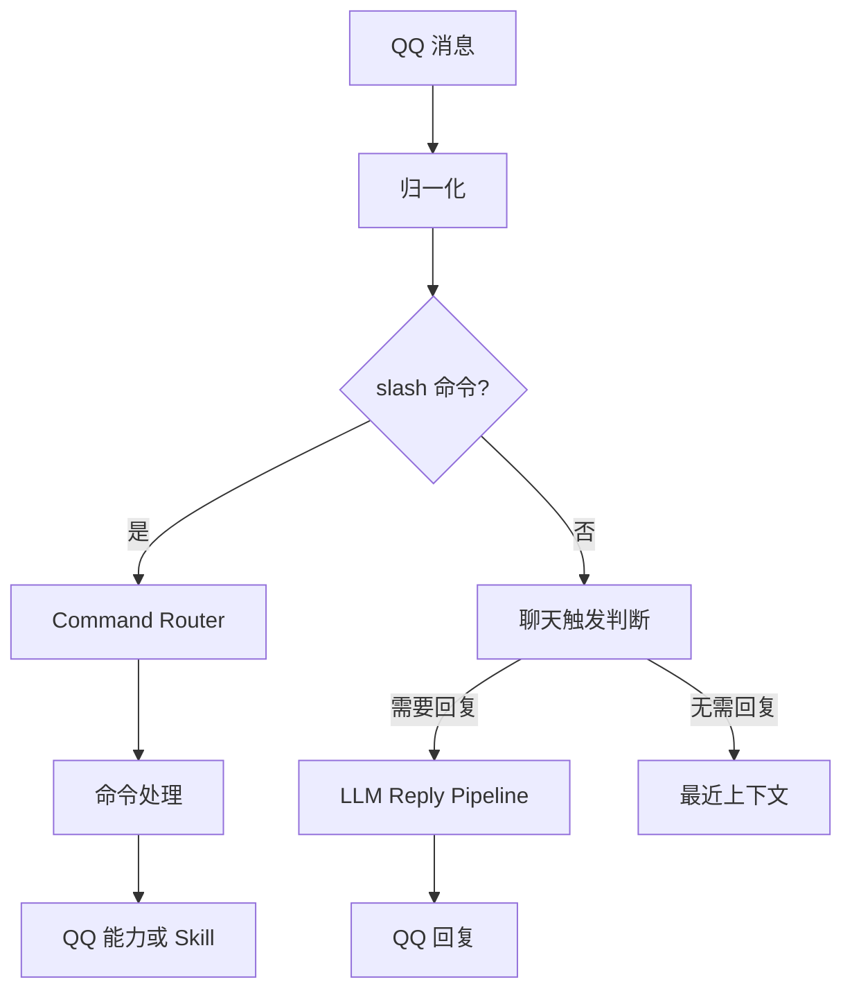

# 小尘 QQ Bot

这是一个基于 QQ 官方 Bot API 的个人 QQ Bot，使用 TypeScript 和 Node.js。它首先提供 QQ 命令、交互和本地能力；LLM 聊天是其中一项能力。

## 当前功能

- `/xxx` 命令由本地路由执行，未知命令由本地回复。
- Minecraft 服务器状态查询、状态卡和刷新按钮共用同一查询能力。
- 群聊和私聊中的 AI 回复支持最近 20 条群聊上下文、已见群成员、按需识图与网页搜索。
- AI 请求有 30 秒硬截止；超时或可重试的上游故障由本地发送固定提示，迟到结果不会再发送。
- 结构化 `qq_reply` 支持 Markdown 和已知成员 @；生成期间群里有新消息时，回复会引用原触发消息。
- 自然聊天时，AI 可通过结构化 `qq_reply` 一次发送最多三条连续 QQ 消息；Node 不按标点自动拆分。
- AI 可按需调用只读 `meme_lookup`，查询项目内维护的网络梗摘要。
- 群聊可按 @、名字或活跃会话触发；模型可以选择 `<NO_REPLY>`。

## 命令

| 命令 | 说明 |
| --- | --- |
| `/help` | 查看可用命令 |
| `/mc` | 查看 Minecraft 服务器状态 |
| `/members` | 查看目前认识的群成员 |
| `/at 昵称` | 测试 @ 已知群成员 |

`/help` 的内容由命令注册表生成。`@小尘 /mc` 会按 `/mc` 处理。未注册的 slash 命令会收到本地提示，不进入 AI 聊天。

## 消息处理



命令消息默认不写入自然聊天的最近上下文。`/mc` 命令和刷新按钮都调用 Minecraft 状态能力，命令文件不复制查询逻辑。

## AI 聊天

群聊中，真正 @ 小尘是强触发；提到“小尘”或处于活跃会话时是软触发。普通非活跃群消息只记录上下文。软触发时模型可以输出 `<NO_REPLY>`。图片仅在满足识图触发条件时发送给模型；网页搜索由模型按需选择。

联网搜索结果会将 Responses API 提供的引用转换为普通 Markdown 来源链接；来源元数据缺失时会隐藏内部引用标记。

### Meme Skill

`src/skills/meme/data/memes.json` 是可提交 Git 的静态网络梗知识文件。Bot 启动时只读取它；聊天中的 `meme_lookup` 最多返回三个相关条目，不会新增或修改知识。查不到时，模型仍可按需使用现有 `web_search` 现场回答，但搜索结果不会写入 Meme Skill。当前知识文件为空，需手动维护后才有本地命中。

维护入口独立于 Bot：

```bash
pnpm meme:update --dry-run
pnpm meme:update "汗流浃背了吧老弟"
pnpm meme:update
pnpm meme:update --limit 10
```

脚本使用 `CODEX_API_KEY` 和 `CODEX_BASE_URL` 调用 Responses API、`web_search` 和严格结构化输出，查找梗的出处、含义及使用语境；Node 校验后合并写入 JSON。`--dry-run` 完成研究与校验，但不写文件。执行写入后，请人工查看 `git diff` 和来源，再决定是否提交。脚本不会执行 Git 操作。Bot 的本地命令不需要 AI 环境变量。

AI 请求使用 Responses API 兼容后端。只有实际发起聊天请求时才读取 `CODEX_API_KEY` 和 `CODEX_BASE_URL`；本地命令不依赖 LLM 服务。

## 项目结构

```text
src/
  main.ts                 启动
  commands/               命令注册表与路由
  qq/
    bot.ts                QQ Bot 创建及事件注册
    handlers/             消息与按钮入口
    message/              入站归一化和触发判断
    conversation/         最近上下文、活跃会话、成员业务规则
    reply/                AI 回复协调与 QQ 发送
    minecraft-status*.ts  Minecraft 状态回复
  skills/                 Minecraft 查询能力与只读 Meme Skill
  ai/                     Responses API、输入和回复结果
  shared/                 日志
  members/                MemberRepository、SQLite 与 D1 适配器
migrations/               D1 成员表迁移 SQL
scripts/meme-update.ts     手动运行的网络梗研究与更新脚本
```

Command 是用户明确调用的 QQ 入口；Skill 是命令、按钮或 AI Tool 可共用的内部能力；LLM 处理普通自然语言聊天。

## 环境变量

| 变量 | 用途 |
| --- | --- |
| `QQBOT_APP_ID` | QQ Bot 应用 ID |
| `QQBOT_APP_SECRET` | QQ Bot 应用密钥 |
| `CODEX_API_KEY` | AI 后端密钥；聊天与 `meme:update` 需要 |
| `CODEX_BASE_URL` | Responses API 兼容后端地址；聊天与 `meme:update` 需要 |
| `BOT_LOG_LEVEL` | 日志级别，支持 `info`、`debug`、`error` |

将密钥放在本地 `.env`，不要提交真实值。`BOT_LOG_LEVEL=info` 适合日常运行；`BOT_LOG_LEVEL=debug` 会输出更多诊断信息。

## 安装与开发

需要 Node.js 和 pnpm。

```bash
pnpm install
pnpm dev
```

静态检查与离线测试：

```bash
pnpm exec tsc --noEmit
pnpm test
```

当前没有单独的 build 或 lint script。

## 本地数据与限制

已见群成员通过 `MemberRepository` 读写。当前 Node.js 运行使用内置 SQLite，数据库位于 `data/bot.db`；`/members`、昵称回填、AI 的 `known_group_members` 和 QQ @ 解析都经由成员服务查询。数据库无法打开时，本次运行会退回内存成员存储并记录错误。已见成员列表不等于 QQ 全群成员列表。

`migrations/0001_group_members.sql` 建立 `group_members` 表。未来接入 Cloudflare Worker 时，可对 D1 执行该迁移，并把 D1 binding 注入 `D1MemberRepository`；仓库目前没有 Worker 入口或 D1 binding 配置，也没有部署到 Cloudflare。最近上下文、活跃会话和待处理 AI 请求仍是内存状态。

旧版 `data/known-members.json` 不会自动导入 SQLite。本仓库当前没有该文件；旧数据可以保留作备份，让 Bot 在群消息中重新学习成员。不要把旧 JSON、SQLite 数据库或成员标识提交到 Git。

当前安装的 QQ SDK 1.0.4 没有普通群消息撤回的入站事件，因此真实撤回暂时无法自动取消 AI 请求；内部已支持按触发消息 ID 取消并删除最近上下文。QQ 平台可用的消息类型和交互能力受官方 API 权限限制。AI 聊天依赖外部 Responses API 兼容后端。
